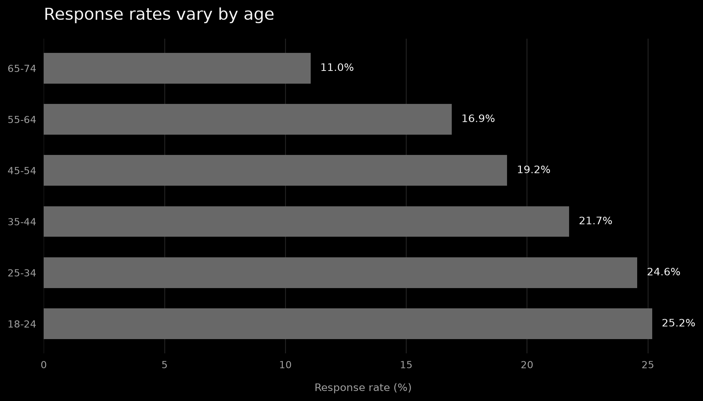
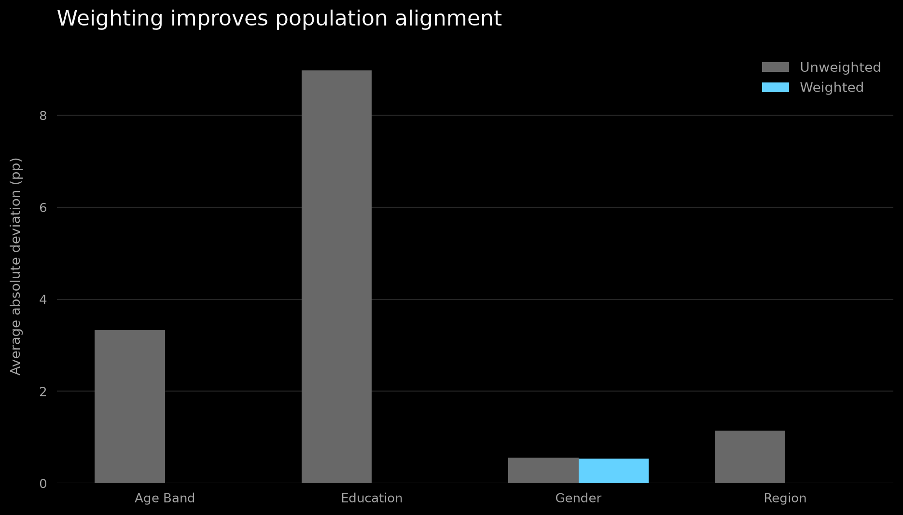
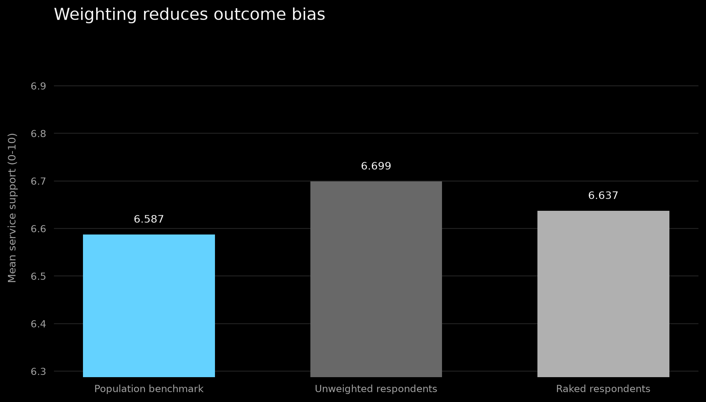

# Nonresponse Bias Assessment

## Project Snapshot

| Project type | Dataset | Tools | Outputs |
|---|---|---|---|
| Simulated Quantitative Case Study | 50,000-Person Synthetic UK Adult Population | Python / Pandas / NumPy / Matplotlib | Response-Rate Tables · Composition Audit · Weighted Estimates · Diagnostics · Dark Figures |

**Skills demonstrated:** Sampling · Statistical Analysis · Data Validation · Data Weighting · Cross-tabulation

## Study context

This simulated case study evaluates nonresponse in a hypothetical UK public-service survey. A known synthetic population makes the true outcome available, while 6,000 people are invited and response depends on demographic and behavioural characteristics. All values are synthetic and are not estimates of the real UK population.

## Objective and method

The analysis measures subgroup response rates, compares respondent composition with the population, quantifies bias in mean service support, and applies iterative proportional fitting (raking) to age band, region and education margins. Weight trimming limits extreme weights to protect precision.

## Response pattern

The invitation sample produced 1,201 respondents, an overall response rate of 20.0%. The lowest observed subgroup rate was 65-74 (11.0%) and the highest was 18-24 (25.2%). Because response propensity is also related to the survey outcome, the respondent mean is not representative without adjustment.

## Bias assessment

| Estimate | Mean service support | Bias versus population |
|---|---:|---:|
| Population benchmark | 6.587 | — |
| Unweighted respondents | 6.699 | +0.112 |
| Raked respondents | 6.637 | +0.050 |

Weighting reduced absolute bias by 55.4%. The remaining bias is residual because raking aligns observed demographic controls but cannot fully correct selection on wellbeing and digital engagement. The weighted effective sample size is 1,058, compared with 1,201 completed interviews.

## Interpretation

The exercise separates three ideas that are often conflated: response rate, demographic representativeness and outcome bias. A sample can have an acceptable overall response rate while still overrepresenting groups with systematically different outcomes. Weighting substantially improves measured composition and reduces bias, but the residual difference from the known benchmark demonstrates why weighting is an adjustment rather than proof of unbiasedness.

## Figures

### Response rates by age

### Composition before and after weighting

### Outcome estimate before and after weighting

## Project files

- [`data/nonresponse_population.csv.gz`](data/nonresponse_population.csv.gz) — compressed CSV containing the known synthetic population, invitation and response indicators.
- [`data/nonresponse_codebook.csv`](data/nonresponse_codebook.csv) — variable definitions.
- [`data/nonresponse_scenario.csv`](data/nonresponse_scenario.csv) — simulation parameters.
- [`outputs/respondents_weighted.csv`](outputs/respondents_weighted.csv) — respondent-level analysis file and final weights.
- [`outputs/response_rates_by_subgroup.csv`](outputs/response_rates_by_subgroup.csv) — subgroup response cross-tabulations.
- [`outputs/composition_before_after_weighting.csv`](outputs/composition_before_after_weighting.csv) — population, raw and weighted shares.
- [`outputs/estimate_bias_summary.csv`](outputs/estimate_bias_summary.csv) — benchmark, unweighted and weighted estimates.
- [`outputs/weighting_diagnostics.csv`](outputs/weighting_diagnostics.csv) — weight range, design effect and effective sample size.
- [`outputs/weighted_subgroup_estimates.csv`](outputs/weighted_subgroup_estimates.csv) — age-by-education estimates.
